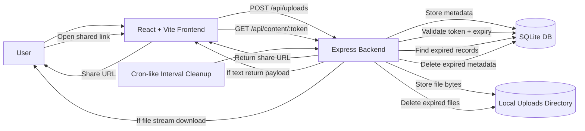

# Data Flow Diagram (High Level)

## Notes
- Access is strictly link-based. No listing APIs are exposed.
- If token is invalid or expired, backend returns `403`.
- Default expiry is 10 minutes if user does not provide expiry.
